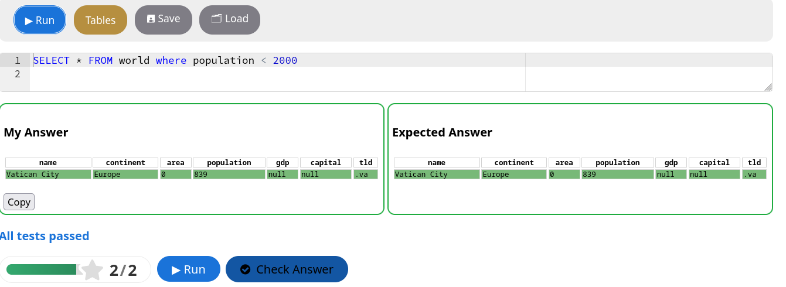

H5P SQL Question
=====================

An interactive SQL question content type for H5P, 
allowing educators to create SQL exercises that 
run and validate queries directly in the browser.

This content type is actively used in teaching, 
tested in real courses, and suitable for self‑study 
and classroom settings.

## What This Does

This H5P content type:

* Provides an interactive SQL environment in H5P.
* Allows authors to define SQL problems and expected results.
* Executes queries in the student’s browser using a JavaScript SQL engine (sql.js).
* Compares student query results against expected table results.
* Works without server‑side execution, making it safe and portable across hosts.
* This content type is based on the H5P question framework and is designed for database teaching and assessment workflows.

## Key Features

* Interactive SQL editor inside H5P
* In‑browser execution with sql.js (no server required)
* Table result comparison for automatic validation
* Integration with common H5P workflows in LMS like Moodle
* Designed for educators and learners in database courses

